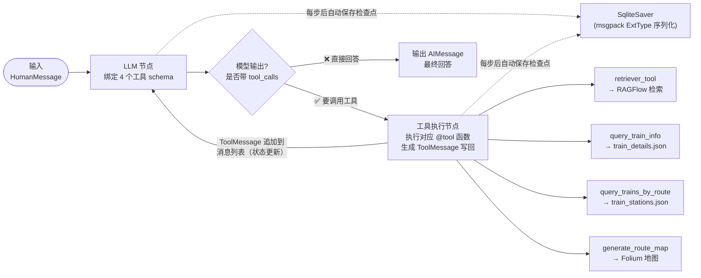
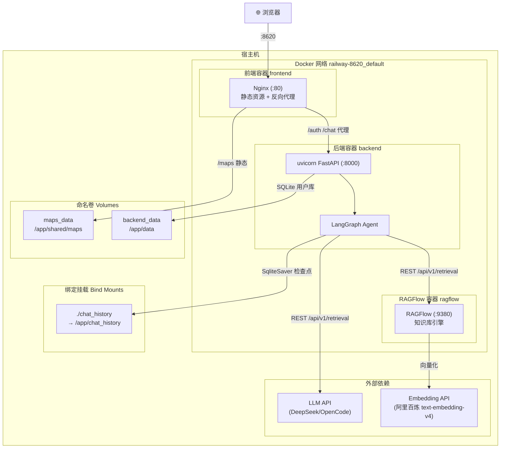
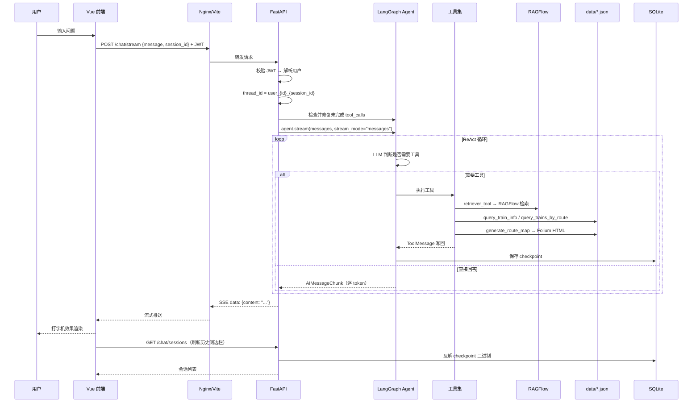
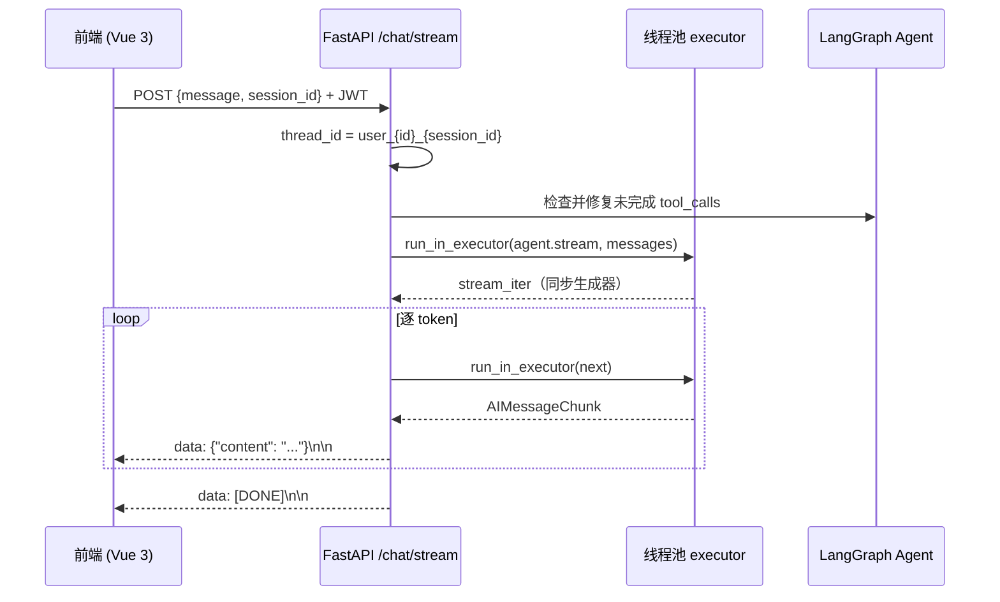

# 🏗️ Railway-8620 架构设计

> 本文档基于真实代码整理，配合 README 的「技术深度」章节阅读。
> 图示为 Mermaid 语法，可在 GitHub / VS Code / Typora 中直接渲染。

---

## 1. 系统整体架构

```mermaid
flowchart TB
    subgraph 用户端
        Browser["🌐 浏览器 (Vue 3 SPA)"]
    end

    subgraph 前端层
        Vite["Vite Dev Server (:8620)<br/>/auth /chat /maps 代理"]
        Nginx["Nginx 生产 (:8620)<br/>反向代理 + 静态资源"]
    end

    subgraph 后端 FastAPI (:8000)
        Auth["🔐 /auth/*<br/>JWT 注册/登录"]
        Chat["💬 /chat /chat/stream<br/>SSE 流式输出"]
        Sessions["📜 /chat/sessions*<br/>历史会话列表"]
        AgentCore["🧠 Agent (LangGraph)"]
    end

    subgraph LangGraph Agent 核心
        LLMNode["LLM 节点<br/>ChatOpenAI / ChatAnthropic"]
        ToolsNode["工具执行节点"]
        Checkpointer["SqliteSaver<br/>checkpointer"]
    end

    subgraph 工具集 Tools
        T1["retriever_tool"]
        T2["query_train_info"]
        T3["query_trains_by_route"]
        T4["generate_route_map"]
    end

    subgraph 外部依赖
        RAGFlow["RAGFlow 知识库<br/>(:9380, 237 篇文档)"]
        DataJSON["data/*.json<br/>车次/站点/坐标"]
        Folium["Folium → HTML 地图<br/>data/maps/*.html"]
        SQLite2["users.db<br/>用户账号"]
        SQLite3["chat_history/checkpointer.db<br/>对话检查点"]
    end

    Browser -->|SSE/REST| Vite
    Browser -->|生产| Nginx
    Vite -->|代理| Auth & Chat & Sessions
    Nginx -->|代理| Auth & Chat & Sessions

    Auth --> SQLite2
    Sessions -->|msgpack 反解| SQLite3
    Chat -->|invoke/stream| AgentCore
    AgentCore --> LLMNode
    AgentCore --> Checkpointer
    LLMNode -->|tool_calls| ToolsNode
    ToolsNode -->|AIMessage + ToolMessage 循环| LLMNode
    ToolsNode --> T1 & T2 & T3 & T4
    Checkpointer --> SQLite3
    T1 --> RAGFlow
    T2 --> DataJSON
    T3 --> DataJSON
    T4 --> Folium
    Folium -->|静态挂载 /maps| Browser
```

**关键数据流：**

- 前端把用户消息 POST 到 `/chat/stream`，后端用 SSE（`text/event-stream`）逐 token 推送回答
- 后端在独立线程里跑 `agent.stream(stream_mode="messages")`，避免阻塞 asyncio 事件循环
- 每次对话状态自动写入 SQLite checkpointer，实现跨轮记忆
- 工具结果直接查本地 JSON 或调 RAGFlow，地图生成后通过 `/maps` 静态路径返回给前端

---

## 2. LangGraph ReAct 循环（核心）



### 循环环节与代码映射

| 循环环节 | 对应代码 | 说明 |
|---------|---------|------|
| LLM 节点 | `agent/llm.py` 的 `create_llm(streaming=True)` | 绑定工具 schema，决定下一步 |
| 工具执行节点 | `agent/tools.py` + `agent/railway_tools.py` | `@tool` + `@log_tool_call` |
| 循环控制 | `create_agent(...)` 内部 `StateGraph` | LLM → 工具 → LLM 直到不再要调工具 |
| 状态持久化 | `SqliteSaver` + `checkpointer` 参数 | 每一步写入 SQLite |
| 流式读取 | `agent.stream(stream_mode="messages")` | 拿 `AIMessageChunk` 级 token |
| 中断修复 | `backend/api.py` 的 `_repair_incomplete_tool_calls` | 补完未闭合的 `tool_calls` |
| 多轮隔离 | `thread_id = user_{id}_{session_id}` | 用户 + 会话双重隔离 |

---

## 3. 部署拓扑（Docker Compose）



**端口映射：**

| 容器 | 内部端口 | 宿主机端口 | 说明 |
|------|---------|-----------|------|
| `frontend` | 80 | **8620** | Nginx 托管 Vue 静态资源 + 反代 API |
| `backend` | 8000 | **8000** | FastAPI 服务 |
| `ragflow` | 9380 | **9380** | RAGFlow 知识库（可选） |

**关键设计：**

- **共享卷 `maps_data`**：后端生成的地图 HTML 写入 `/app/shared/maps`，前端 Nginx 通过只读挂载 `/usr/share/nginx/maps:ro` 直接提供 `/maps/` 静态访问，无需经过后端
- **绑定挂载 `./chat_history`**：对话检查点 SQLite 持久化到宿主机，容器重建不丢失
- **SSE 反代**：Nginx 对 `/chat/` 关闭 `proxy_buffering`，保证流式输出实时到达浏览器
- **RAGFlow 可选**：不启动 RAGFlow 时，车次查询/地图生成/对话功能不受影响，仅知识库检索不可用

---

## 4. 一次完整请求的数据流（时序）



---

## 3. 流式对话时序（SSE）



> 注意：同步的 `agent.stream()` 全部在独立线程中执行，事件循环只做 `await`，
> 用哨兵对象替代 `StopIteration` 避免被 asyncio 包装成 RuntimeError。
